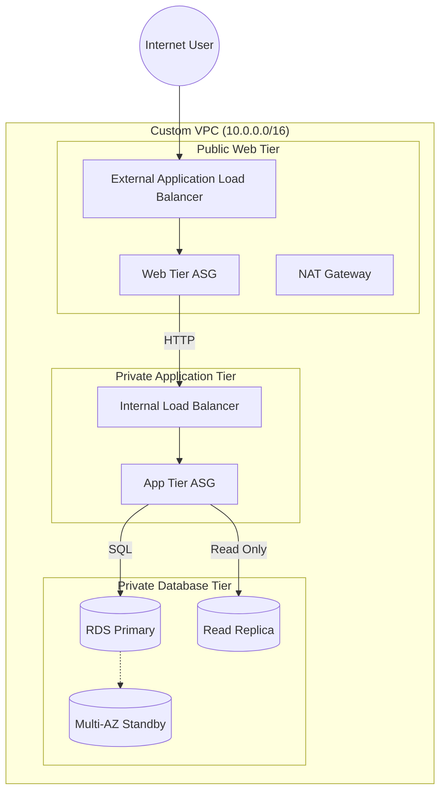

# ☁️ AWS Highly Available Multi-Tier Infrastructure (Uber-Clone)

[](https://www.terraform.io/)
[](https://aws.amazon.com/)
[](LICENSE)

## 📌 Executive Summary

This repository hosts the **Infrastructure as Code (IaC)** for a production-grade, three-tier web application architecture. Designed to simulate a high-traffic platform (e.g., an Uber clone), this project leverages **Terraform** to provision a secure, fault-tolerant, and auto-scaling environment on AWS.

The architecture strictly adheres to the **AWS Well-Architected Framework**, prioritizing operational excellence, security, and reliability through Multi-AZ deployment and a tiered security model.

---

## 📐 Architecture & Traffic Flow

The following tree illustrates the request flow from the public internet down to the secured data layer.



### 🌳 Logical Traffic Tree

```text
INTERNET (User Traffic)
│
└── 🛡️ External Application Load Balancer (Public Subnet)
    │   ├── 🚦 Rule: Forward HTTP:80 -> Web Target Group
    │
    └── 💻 Web Tier Auto Scaling Group (Public Subnets)
        │   ├── Instance A (ap-south-1a)
        │   ├── Instance B (ap-south-1b)
        │   │
        │   └── 🔌 Connection: Proxy to Internal LB
        │
        └── 🛡️ Internal Application Load Balancer (Private Subnet)
            │   ├── 🚦 Rule: Forward HTTP:80 -> App Target Group
            │
            └── ⚙️ App Tier Auto Scaling Group (Private Subnets)
                │   ├── Instance A (ap-south-1a)
                │   ├── Instance B (ap-south-1b)
                │   │
                │   └── 💾 Database Connection
                │
                └── 🗄️ RDS Database Cluster (Private Subnets)
                    ├── 👑 Primary Instance (Multi-AZ Enabled)
                    ├── 👻 Standby Instance (Hidden/Failover)
                    └── 📖 Read Replica (Performance Scaling)

```

---

## 🛠️ Infrastructure Components

### 1. 🌐 Networking Layer (`/modules/vpc`)

* **VPC Strategy:** Custom `/16` VPC with granular subnetting.
* **Subnets:** 6 total subnets (2 Public, 4 Private) distributed across 2 Availability Zones.
* **Connectivity:** * **IGW:** For public ALB and Bastion access.
* **NAT Gateways:** Redundant NATs for private instance outbound traffic.


### 2. ⚡ Compute & Scaling (`/modules/*_asg`)

* **Web Tier:** Public-facing Apache servers handling frontend traffic.
* **App Tier:** Isolated backend servers handling business logic.
* **Auto Scaling:** Dynamic scaling policies based on CPU utilization metrics (Scale-out @ 70%, Scale-in @ 20%).

### 3. ⚖️ Load Balancing (`/modules/alb`, `/modules/ilb`)

* **External ALB:** Entry point for users; offloads SSL (optional) and routes to Web Tier.
* **Internal ILB:** Acts as the secure bridge between Web and App tiers, preventing direct access to the backend.

### 4. 🗄️ Database Layer (`/modules/rds`)

* **Engine:** MySQL 8.0 on `db.t3.micro`.
* **Reliability:** Synchronous **Multi-AZ** replication for zero-data-loss failover.
* **Performance:** Asynchronous **Read Replica** to handle read-heavy analytical queries.

---

## 📂 Project Directory Structure

The project is modularized to ensure reusability and maintainability.

```text
.
├── main.tf                   # 🧠 Master Configuration (Module Orchestration)
├── variables.tf              # 🔧 Global Variables
├── outputs.tf                # 📤 Key Infrastructure Outputs
├── terraform.tfvars          # 🔐 Secrets (Excluded from Git)
├── modules/                  # 📦 Reusable Infrastructure Modules
│   ├── vpc/                  #    ├── Networking & Routing
│   ├── security_groups/      #    ├── Firewall & Access Rules
│   ├── alb/                  #    ├── Public Load Balancing
│   ├── ilb/                  #    ├── Private Load Balancing
│   ├── web_asg/              #    ├── Frontend Compute & Scaling
│   ├── app_asg/              #    ├── Backend Compute & Scaling
│   └── rds/                  #    └── Database Cluster
└── README.md                 # 📄 Documentation

```

---

## 🚀 Deployment Guide

### Prerequisites

* **Tools:** Terraform v1.0+, AWS CLI, Git.
* **AWS:** An active account with Admin permissions.
* **Keys:** An EC2 Key Pair (`cloud.pem`) created in `ap-south-1`.

### Step-by-Step Execution

1. **Clone the Repository**
```bash
git clone [https://github.com/YOUR_USERNAME/uber-clone-infra.git](https://github.com/YOUR_USERNAME/uber-clone-infra.git)
cd uber-clone-infra

```


2. **Initialize the Backend**
Downloads provider plugins and initializes the working directory.
```bash
terraform init

```


3. **Configure Environment**
Create a `terraform.tfvars` file to store sensitive inputs:
```hcl
project_name = "uber-clone"
db_username  = "admin"
db_password  = "StrongPassword123!"
ec2_key_name = "cloud"

```


4. **Plan & Apply**
Visualize the changes and provision the infrastructure.
```bash
terraform plan
terraform apply --auto-approve

```


---

## 📊 Infrastructure Outputs

After a successful deployment, Terraform will output the connection endpoints:

| Output Key | Description | Use Case |
| --- | --- | --- |
| **`application_url`** | Public DNS of External ALB | Access the web application via browser |
| **`internal_app_url`** | Private DNS of Internal ILB | Internal API calls from Web to App tier |

---

## 👤 Author

**[Your Name]** *DevOps Engineer & Cloud Architect* [Link to your LinkedIn] | [Link to your Portfolio]

---

```

```